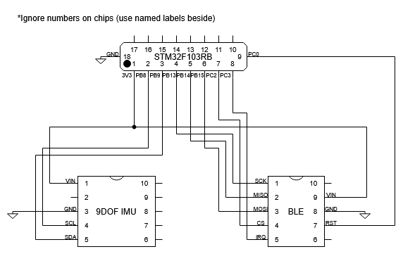
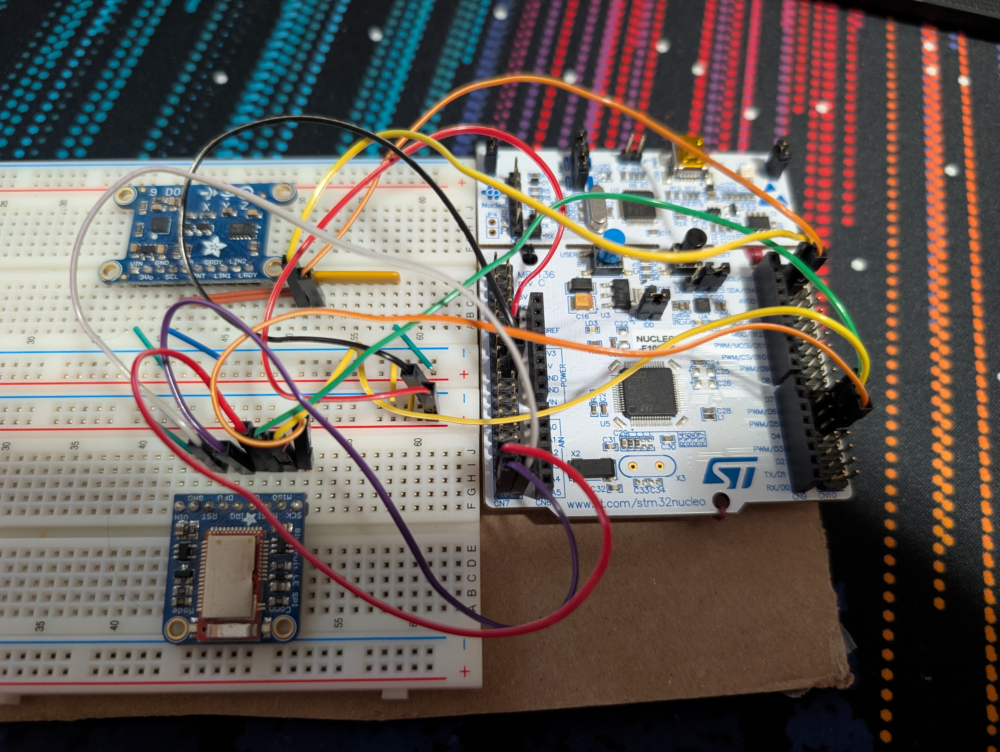
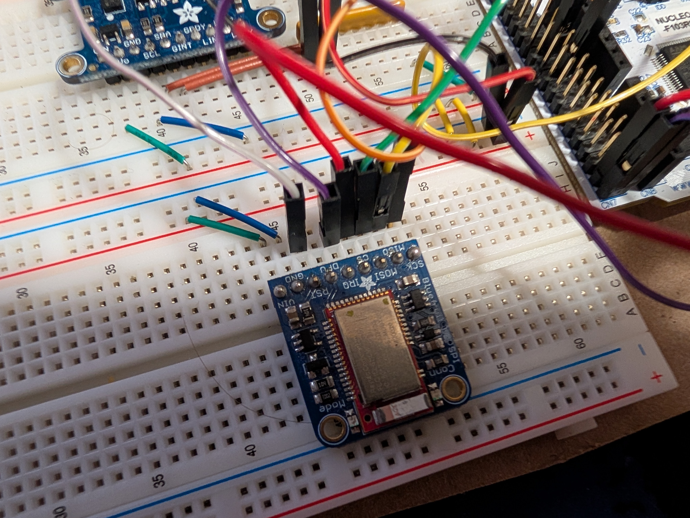
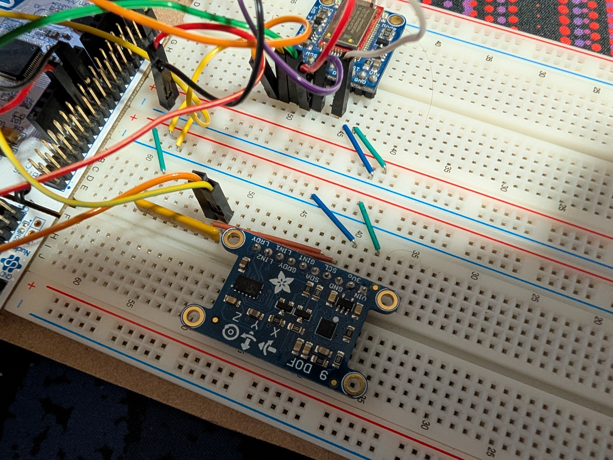

# Cube Visualization Project
Not an actual cube due to time constraints (but kept the name)

## Setup
Assemble the components as shown in the schematic below. I've also included an image showing the completed circuit.

Build and flash the device using STM32CubeIde (code in cube dir)

Install the python dependancies and run the server (code in visualizer_interface dir). Instructions in [visualizer_interface/readme.md](visualizer_interface/readme.md)

Run the godot visualizer (code in visualizer). The node `RotationOffset` can be rotated to allign the visualization with the starting direction expected. (ex. if your computer is facing south, but the IMU expects heading 0 to be north)